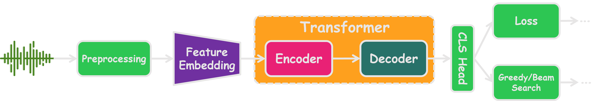
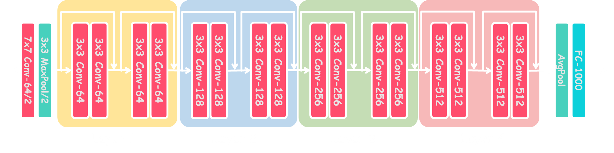

# speech_recognition
In this project, I have trained models for Speech Recognition task using `Pytorch` frame work. 
I used [Lj speech dataset](https://keithito.com/LJ-Speech-Dataset/) fot this project. 

## models

### Transform based model

The first model I used was a transformer based model

as you can see a `Transformer` is the responsible foe feature extraction, and after the feature extraction a classifier will operate.

### ResNet Based model

The second model I used was a `ResNet` Based model, since it is a good feature extractor, I used it for this project:

